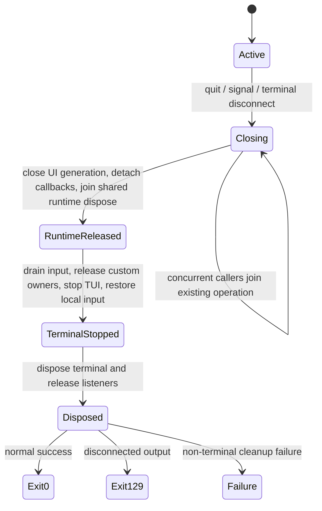

# G2S adversarial self-audit

Scope: cumulative changes from `d5516ca39bfd7940f8bce76ea6aeb63616099383`. This audit distinguishes observed checks from remaining limitations; it is not a manual Alpha pass. The immutable old-production red is `ed023a6c78e0d075866195fc306cc686f511f897`.

## Final lifecycle ownership

Runtime disposal publishes one operation before abort or extension callbacks, continues mandatory cleanup after errors, preserves the first failure, clears temporary callbacks and cancels pending replacements. Session replacement uses its own outgoing teardown and preserves the live-TUI reset/rebind behavior. Final shutdown synchronously closes extension UI handles and disarms replacement UI callbacks before its first await. Normal and signal exits now both perform runtime cleanup before terminal restoration; an EPIPE/EIO event joins that owner instead of hard exiting before cleanup. The terminal's disposed-write rejection is unchanged.

| Adversarial dimension | Observed evidence | Limit |
| --- | --- | --- |
| 1/2/3/100 concurrent runtime callers, repeated success/failure, callback reentrancy, all shutdown/invalidation/session throw combinations | `alpha-runtime-dispose.test.ts`; shared Promise and exactly-one counts, original error preserved | An extension awaiting its own enclosing shutdown is not claimed to be cancellable |
| Normal quit / Ctrl+D / double Ctrl+C / extension shutdown | Actual CLI in regular/fullscreen, exit 0, one shutdown event, raw=false, paste disable observed | Pipe-backed CLI, not native emulator paint |
| SIGTERM / SIGHUP | Actual signal-aware shutdown also covered production-shaped; process cases run on POSIX CI | Windows cannot emulate POSIX signal delivery; four process cases explicitly skipped |
| Idle / streaming / tool / manual compaction / branch summary / bash | Actual session/runtime owners; cooperative abort and auxiliary settlement before disposal; bounded timeout rejects non-cooperative work | No universal cancellation of arbitrary third-party promises |
| Dead stdout while idle/stream/tool/compaction | Eight actual CLI cases: exit 129, shutdown=1, raw=false | Cursor/paste delivery cannot succeed on a closed output |
| Error / close / slow callback / backpressure / drain / never callback / pending frame | Real ProcessTerminal + Writable and frame-queue tests; bounded shutdown, late callbacks, final-frame ownership | Component/queue tests and CLI tests form complementary layers, not every Cartesian combination in a native PTY |
| Uncaught failure / partial startup failure | Actual fatal recovery and six injected initialization-phase faults per mode; original cause and mandatory cleanup | The user's configured-copy startup cause is still unconfirmed |
| Quit before init / during startup awaits / concurrent quit | Real initialization cancellation generations; stale continuation does not write/register listeners | SDK creation and constructor timing are not individually exposed by the import-only CLI capture |
| Cold startup / G2 off/on / no/no-op/UI extension / 0/5k/50k history | 36 startup combinations; 25 start/quit cycles per mode; listener/raw/dispose counters | These are deterministic isolated projects |
| Trusted/untrusted project startup | Four actual CLI cases: isolated saved decisions, discovered project extension executes once only when trusted, input-ready once, normal cleanup | Interactive trust selection dialog itself is not claimed tested |
| Settings absent / malformed / valid | Actual CLI uses production config path, malformed input reported and left unchanged | Does not replay the user's real private settings |
| Theme / tool ensure / rebind / initial history / provider count / first render failure | Real cleanup after deterministic fault injection; phase original cause preserved | Tool ensure failure injection is not an assertion about every installed fd/rg binary/version |
| New / fork / resume | Real replacements in both modes: old handles inert, live reset counts preserved, prior artifacts/cursors invalid in new owner | Tree selection UI itself is distinct from branch-summary cancellation |
| Custom footer / widget / title | Real custom footer factory/dispose once; release before terminal; late factory not invoked; footer WeakRef clears while closed mode remains held | Arbitrary extension code retaining a raw external resource must still release that resource in its own disposer |

## Stream and delta shapes

`alpha-stream-corpus.test.ts` covers 17 corpora across L0–L3 and 1/4/16/64-character delta shapes, including CJK, combining/emoji, ANSI, long words, Markdown structures, code fences, links, LaTeX, thinking and tools. Growing responses through 256 KiB, first-delivery-final, last-delta-immediately-final, abort and error have separate canonical/queue checks. Visible-marker checks require markers to be visible under a fresh renderer; the earlier Markdown-table fixture ambiguity is corrected without dropping the final marker assertion.

The 100,000-update stress measures actual session-to-UI updates, independently of provider observer coalescing. Active completed/offscreen render delta is zero, no full-history fallback, pending intent <=1, frame queue <=2, final message/frame delivered. Retained append attribution is bounded by 4096 line references / 512 Ki code units, with exact base-version proof; replacement, shrink, width/theme invalidation, stale/multiple mutations and capacity overflow stay conservative. Completion releases the active snapshot after final attribution. Existing incremental golden/randomized Markdown tests remain authoritative; no second parser or session-global render cache was added.

## Raw results and recovery

The raw fixture bypasses all shells, read and MCP. A pinned manifest now locks each default mode's bytes/code units/SHA-256 and the decoded PNG digest. ANSI remains 230,079 bytes with the original sequence-heavy payload. All continuation chains validate budget, strict cursor progress, exact omitted-source reconstruction, terminal/grapheme/CRLF atomicity, unchanged artifact identity/content, and no per-chunk digest/full-estimator scan. Index storage remains bounded to 49,152 bytes. Counts through 65,536, multiple blocks and incomplete/oversized atomic sequences are covered.

129@1024 is the typed fail-closed boundary: 129 tools/end events, one provider request, no replay, canonical UI recovery and cleanup. 129@16384 separately completes the full provider chain with all 129 results in order and all 129 continuations usable. No batch manifest, contextual-budget semantics or provider wire change. PowerShell's tool-level truncation remains separately labeled, with its complete spill path; it is not raw G2 projection evidence.

## Ownership and allocations

Audit the entire chain, including frozen callees: provider/event → AgentSession → InteractiveMode → AssistantMessage → Markdown → retained viewport → root/diff → frame queue → ProcessTerminal. `alpha-source-audit.ts` records syntactic sites and call targets; it does not infer dynamic allocations from source counts. The measured frame/observer path creates no Promise/AbortController/options wrapper/timer per update, no Promise tail/array, and no copied full frame. Bounded reference arrays and genuine rendered output strings are reported rather than called zero allocation.

Low-frequency operations retain objects across awaits only until their shared operation settles: startup owns its generation and partial owners; replacement owns the outgoing session and factory result until apply/cancel; shutdown owns the runtime and first failure until cleanup completes; auxiliary wait owns one callback pair and interval until settlement/deadline; terminal owns one active write and at most one pending latest frame. Failed/non-cooperative external callbacks are not made collectible by falsely reporting completion. Runtime session/services remain readable for existing consumers and resume hints; canonical messages can remain reachable if an external caller deliberately retains that runtime. Seven-owner WeakRef stress instead checks release after the owning fixture itself is dropped.

Shared Markdown tokenizer lexer retention was reproduced in a heap snapshot and eight red tests. The synchronous finally restoration handles success, failure and reentrant parsing without retaining the last token tree. V8 RegExp last-match retention is reported separately. Footer's existing history copy remains; indexed traversal avoids per-entry iterator protocol work, and status comparator/sanitizer callbacks are now stable module references with identical output. No new pool was introduced. Existing READ_GROUP pools remain unmodified and disclosed.

## Findings requiring explicit disposition

- B0/B1 confirmed correctness findings have local red/green evidence. Final exact-head CI and Candidate Review are still required before treating the cumulative candidate as accepted.
- `G2S-B0-CANDIDATE-STARTUP`: user's configured-copy failure unconfirmed; privacy-safe capture is available. Clean-HOME sentinel failure is a separate reproduced/fixed finding.
- C — strict provider-marker two-interval timing is not uniform; 256 KiB initial/final burst root durations exceed target; full-chain dynamic allocation counts are not universally zero. Do not reinterpret fixture token rate as real model throughput.
- C — controlled-GC owner WeakRefs clear, but total-heap samples contain small staircase changes. No strict universal zero-slope claim.
- C — every native startup dependency variant and individually timed runtime/constructor phases are not closed by the current isolated capture/matrix. Saved trusted/untrusted decisions are now covered; the interactive trust selection dialog is a separate unclaimed path. Keep coverage limits visible in review.
- D — one-sequence ANSI index still allocates approximately 48 KiB; no unnecessary storage rewrite.
- D — `D-G2D-HIGH-FANOUT-BATCH-MANIFEST`, requiring a future aggregate recovery protocol; not implemented.

Provider adapters/wire, model protocol, session JSONL, read/MCP, Evidence Ledger, operation-id, Harness v2, contextual-budget algorithm and artifact/cursor formats remain frozen. Rollback reference is unchanged `d5516ca`; no reset, clean, rebase, merge or rollback was executed. G3–G10 remain unstarted. Candidate must remain Draft and await external final review and explicit merge authorization.
